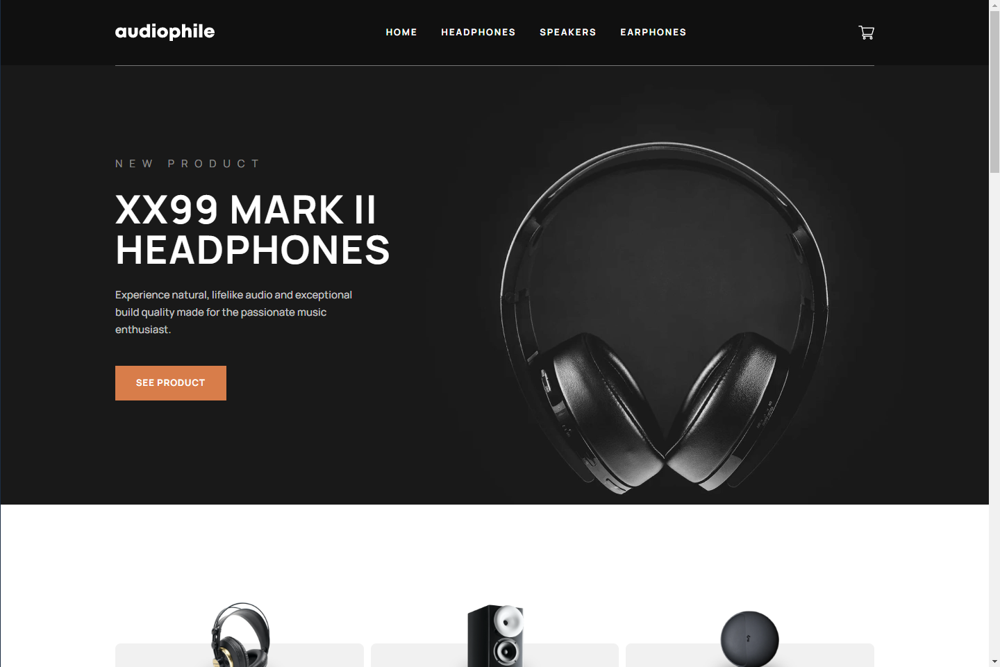
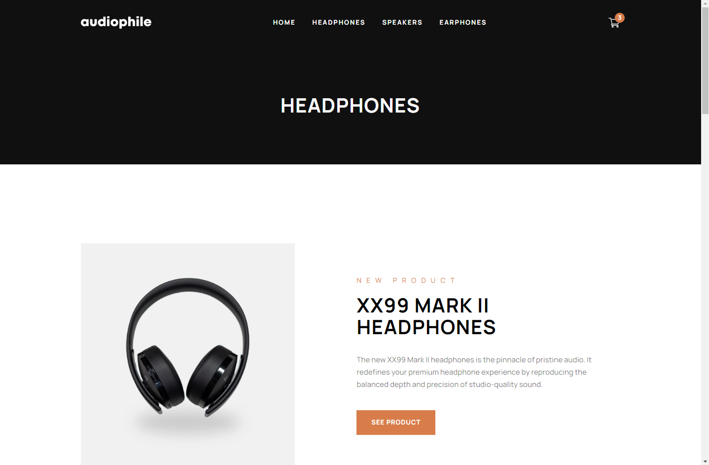
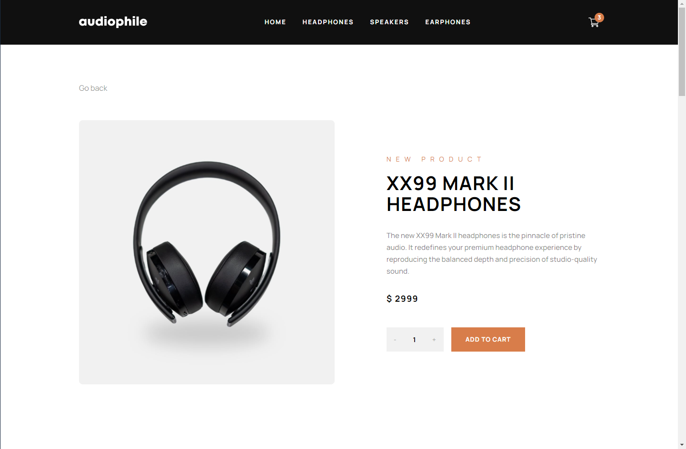
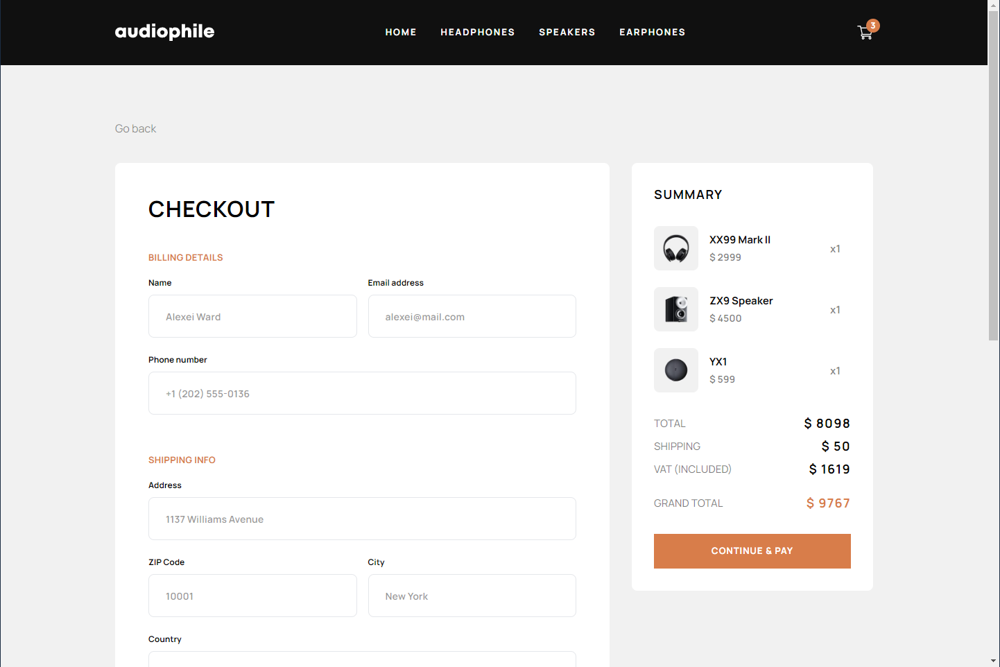

# Frontend Mentor - Audiophile e-commerce website solution

This is a solution to the [Audiophile e-commerce website challenge on Frontend Mentor](https://www.frontendmentor.io/challenges/audiophile-ecommerce-website-C8cuSd_wx).

## Table of contents

- [Overview](#overview)
  - [Features](#features)
  - [Screenshot](#screenshot)
  - [Links](#links)
- [My process](#my-process)
  - [Built with](#built-with)
  - [What I learned](#what-i-learned)
  - [Continued development](#continued-development)
  - [Useful resources](#useful-resources)
- [Author](#author)

## Overview

### Features

Users are able to:

- Add/Remove products from the cart
- Edit product quantities in the cart
- Fill in all fields in the checkout
- Receive form validations if fields are missed or incorrect during checkout
- See correct checkout totals depending on the products in the cart
  - Shipping always adds $50 to the order
  - VAT is calculated as 20% of the product total, excluding shipping
- See an order confirmation modal after checking out with an order summary
- **TODO**: Keep track of what's in the cart, even after refreshing the browser (`localStorage`)

### Screenshot

### Links

- Solution URL: [https://www.frontendmentor.io/solutions/react-tailwindcss-that-was-incredibly-tough-and-fun-d-Az7rnLQVWc]
- Live Site URL: [https://bbualdo-audiophile.netlify.app]

## My process

First of all I predefined components that I will probably need and put all the files into proper folders to keep my project organised. Then I set up **React Router** paths to each category and cart. After that I started to build my components and styled it using **TailwindCSS** one by one. Meanwhile I was implementing states and logics for Hamburger Menu button. When every part of the webpage that is reusable was styled I implemented fetching data from provided JSON file and displaying it properly on the Product page. Then styling again and Product pages were completed. Meanwhile I had some issues with displaying data after page deployment. It was a long "cat & mouse" game with fetched JSON and image paths, but I did it. Yay!
Each product has to be shown in detail after clicking "See Product" button, so I used provided "slug" property in each of them to give an id to each path in **React Router**.
After that some **JavaScript** logic and I finished implementing adding to cart, change quantity and merge products if added product already existed in the cart. In the end I coded and styled checkout page with form validation.

### Built with

- React
- TailwindCSS
- CSS custom properties
- Semantic HTML5 markup
- Flexbox

### What I learned

1. React Router.
2. TailwindCSS.
3. Got more confidence in using React.

### Continued development

1. That project shows me that I must learn better state managment approach, because I made quite a prop drilling out there. Considering Redux or Context.

2. I don't think that Tailwind is good choice for that big projects, because when you look at JSX structure it is quite a mess. I started to learn Sass because of it's similarity to JavaScript and reusability.

3. I should probably split this App into more components. I will consider that in future projects.

4. After that I started learning **TypeScript** for cleaner and less error prone code.

### Useful resources

- [React Router 6 Course](https://scrimba.com/learn/reactrouter6) - This helped me for a lot in understanding React Router. Bob Ziroll is just a god teacher!

## Author

- Website - [BBualdo](https://bbualdo-portfolio.netlify.app)
- Frontend Mentor - [@bbualdo](https://www.frontendmentor.io/profile/bbualdo)
